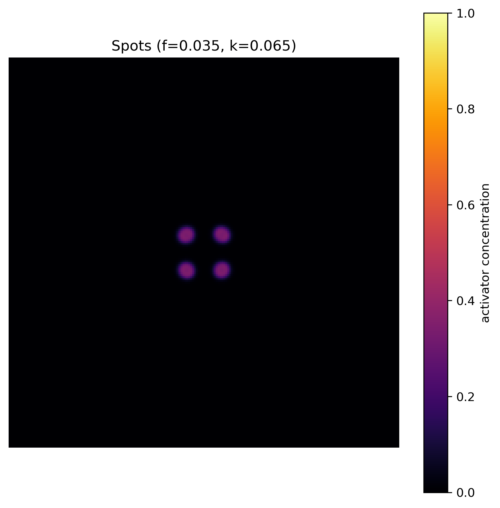
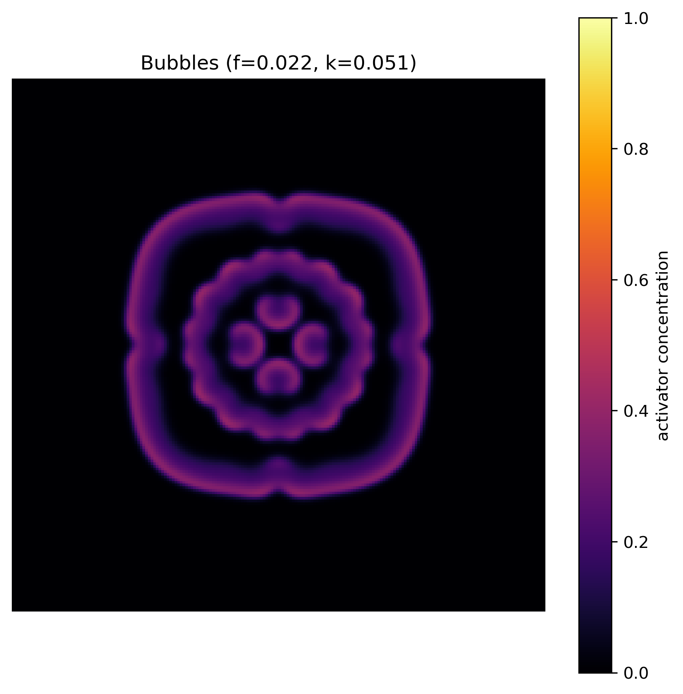
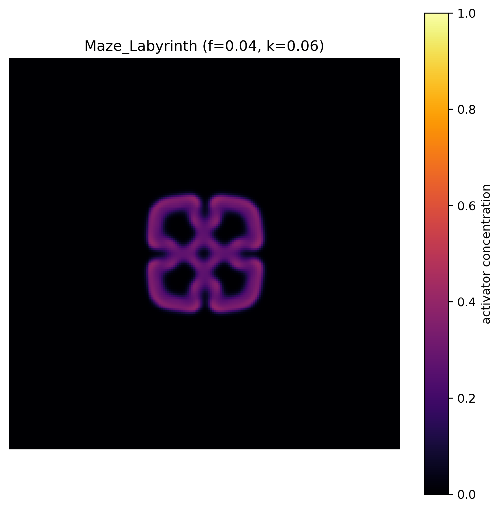
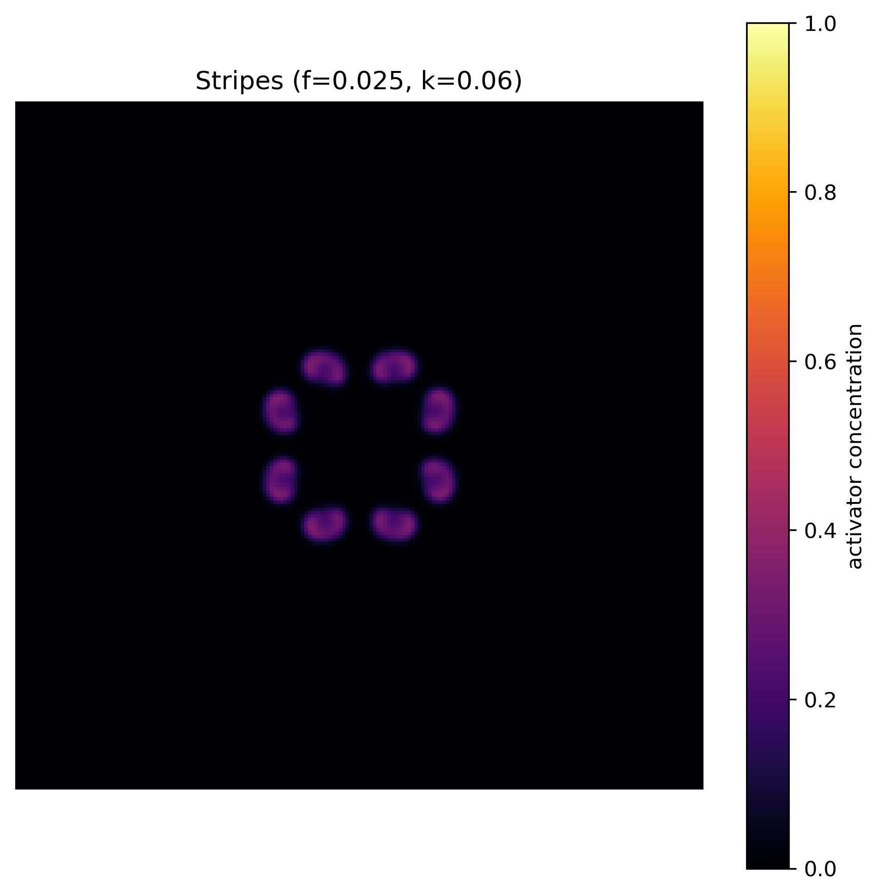
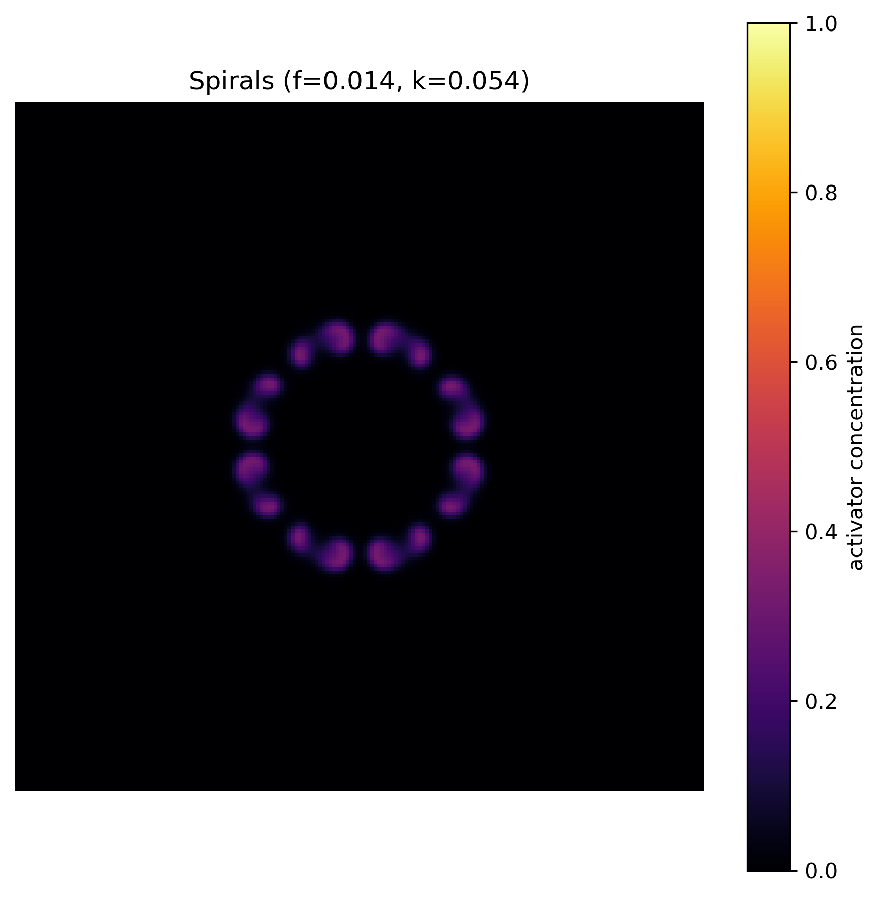

# Turing Pattern Simulation
### Gray-Scott Reaction-Diffusion System

*Srinija Palacharla · IIT Guwahati, ECE '29*

---

> **Notation note:** The standard Gray-Scott literature uses `u` and `v` for the two chemical species. In this implementation, the variables are named `a` (activator) and `h` (inhibitor) to make the biological interpretation explicit in the code. The equations and dynamics are identical; only the variable names differ.

---

## Overview

Turing's 1952 paper *"The Chemical Basis of Morphogenesis"* proposed that spatially periodic patterns in biological systems — coat markings, digit spacing, leaf venation — can arise not from explicit genetic specification but from a mathematical instability in a system of reacting, diffusing chemicals. This repository implements a numerical simulation of that mechanism using the **Gray-Scott model**, an autocatalytic reaction-diffusion system that exhibits many of the pattern-forming phenomena associated with reaction-diffusion theory.

The simulation was developed during a semester break after first year, as a continuation of earlier work on single-neuron dynamics (Hodgkin-Huxley and Izhikevich models) — extending from temporal dynamics in a point neuron to spatial self-organisation across a two-dimensional chemical field.

---

## Background

### The Turing Instability

A central interpretation of Turing's framework involves two diffusing chemical species: a slowly diffusing activator that promotes its own production, and a rapidly diffusing inhibitor that suppresses it. When the inhibitor diffuses sufficiently faster than the activator, a spatially uniform steady state — stable in the absence of diffusion — can be destabilised by diffusion itself, giving rise to stable spatial patterns.

The Gray-Scott model is an autocatalytic reaction-diffusion system that shares many of the pattern-forming features of this framework. It was originally proposed by Gray and Scott (1983, 1984) in the context of chemical engineering, not as a direct model of biological morphogenesis. Its connection to Turing's framework lies in their common mathematical structure: both involve a nonlinear reaction coupled with asymmetric diffusion, producing diffusion-driven instability. The Gray-Scott model is not a canonical activator-inhibitor system in the strict sense, but it undergoes Turing-type instabilities across a range of its parameter space, as documented by Pearson (1993).

### Why Diffusion Can Destabilise a Uniform State

In the absence of diffusion, the uniform steady state of the Gray-Scott system is stable: small perturbations decay. The introduction of diffusion modifies this. A local perturbation in activator concentration initiates autocatalytic amplification. The inhibitor produced in the same reaction diffuses away from the local region rapidly, suppressing neighbouring areas before the local peak is checked. The local perturbation grows; neighbouring regions are suppressed. The uniform state breaks into a spatially structured one.

This is a diffusion-driven instability, distinct from the more familiar role of diffusion as a smoothing process.

### Linear Stability Analysis

To identify which spatial modes grow and at what length scale, the system is linearised around its uniform steady state (a₀, h₀) and perturbed by spatial modes:

```
a(x,t) = a₀ + δa · exp(λt + ikx)
h(x,t) = h₀ + δh · exp(λt + ikx)
```

Substitution into the linearised equations yields a dispersion relation λ(k): the growth rate as a function of wavenumber k. Turing instability requires λ(k) > 0 for some k ≠ 0. The wavenumber k\* that maximises λ(k) determines the dominant spatial wavelength of the emerging pattern:

```
Λ = 2π / k*
```

Linear analysis determines the wavelength. Nonlinear saturation — not captured by the linearisation — determines the morphology. Simulation is required for the latter.

---

## The Gray-Scott System

### Equations

```
∂a/∂t = Da ∇²a  +  h·a²  −  (f + k)·a
∂h/∂t = Dh ∇²h  −  h·a²  +  f·(1 − h)
```

### Parameters

| Symbol | Meaning | Value |
|--------|---------|-------|
| a(x,y,t) | Activator concentration | — |
| h(x,y,t) | Inhibitor concentration | — |
| Da | Diffusion coefficient, activator | 0.08 |
| Dh | Diffusion coefficient, inhibitor | 0.16 (static) · 0.20 (animation) |
| f | Feed rate | varies (see simulations) |
| k | Kill rate | varies (see simulations) |

### Term-by-Term Description

- **Da ∇²a** — Diffusion of the activator.
- **+h·a²** — Autocatalytic production: activator concentration is amplified in proportion to h·a². This is the nonlinear coupling term — wherever both species are present, `a` is produced and `h` is consumed.
- **−(f + k)·a** — Removal of the activator by feed dilution (f) and kill rate (k).
- **Dh ∇²h** — Diffusion of the inhibitor, at a rate greater than the activator.
- **−h·a²** — Consumption of the inhibitor in the autocatalytic reaction.
- **+f·(1 − h)** — Replenishment of h at rate f, proportional to its distance from saturation.

### Note on the Gray-Scott Model

The Gray-Scott model was originally formulated to describe autocatalytic reactions in a continuously stirred tank reactor. It is not a direct derivation from Turing's 1952 framework, nor was it proposed as a biological model. Its relevance to morphogenesis arises from the observation — systematically explored by Pearson (1993) — that it undergoes diffusion-driven instabilities producing spatial patterns qualitatively similar to those predicted by Turing's theory. The two models share a common mathematical framework but have distinct origins.

---

## Numerical Implementation

### Discretisation

The simulation runs on a 200×200 periodic grid (dx = 1.0). Time integration uses the explicit Euler method:

```
a_new = a + dt · (Da · ∇²a + h·a² − (f+k)·a)
h_new = h + dt · (Dh · ∇²h − h·a² + f·(1−h))
```

The Laplacian is computed with a 5-point finite difference stencil:

```python
def Laplacian(z):
    return (np.roll(z, 1, axis=0) + np.roll(z, -1, axis=0) +
            np.roll(z, 1, axis=1) + np.roll(z, -1, axis=1) - 4*z) / dx**2
```

Boundary conditions are periodic, implemented via `np.roll`.

### Timestep and Stability

The two scripts use different timestep strategies:

- **Static** (`turing_patterns_static.py`): `dt = 1.0`, 1000 steps.
- **Animation** (`turing_patterns_animation.py`): `dt = 0.01`, 30 substeps per frame, 500 frames (15,000 effective steps).

For the explicit Euler method applied to the 2D diffusion equation with a 5-point stencil, the stability condition is:

```
dt ≤ dx² / (4 · max(Da, Dh))
```

The factor of 4 (rather than 2 in the 1D case) arises because the 2D stencil distributes the Laplacian across four spatial directions. With dx = 1.0 and Dh = 0.16, the bound gives dt ≤ 1.5625, so the static simulation's dt = 1.0 satisfies this. The animation's dt = 0.01 is well within it.

### Initialisation

Both scripts use the same initialisation:

```python
a = np.zeros((N, N))
h = np.ones((N, N))
r = 10
cx, cy = N//2, N//2
a[cx-r:cx+r, cy-r:cy+r] = 0.25
h[cx-r:cx+r, cy-r:cy+r] = 0.50
a += 0.02 * np.random.randn(N, N)
h += 0.02 * np.random.randn(N, N)
a, h = np.clip(a, 0, 1), np.clip(h, 0, 1)
```

The localised seed (20×20 centre region) breaks translational symmetry and nucleates the pattern. The random noise (σ = 0.02) allows spatial modes to compete across the domain; the mode selected by the dispersion relation grows and eventually dominates.

---

## What I Found

Sweeping the (f, k) parameter plane, as Pearson mapped in 1993, reveals a zoo of patterns emerging from the same equations:

→ Spots · Bubbles · Maze / Labyrinthine · Stripes · Spirals

The same PDE, different parameters — the diversity comes purely from where you set the knobs.

| Spots | Bubbles | Maze / Labyrinthine |
|:---:|:---:|:---:|
|  |  |  |
| f=0.035, k=0.065 | f=0.022, k=0.051 | f=0.040, k=0.060 |

| Stripes | Spirals |
|:---:|:---:|
|  |  |
| f=0.025, k=0.060 | f=0.014, k=0.054 |

---

## Repository Structure

```
turing-simulations/
├── turing_patterns_static.py     # 5 parameter sets → static PNG outputs
├── turing_patterns_animation.py  # Single parameter set → MP4 animation
├── simulation_outputs/
│   ├── spots.png
│   ├── bubbles.png
│   ├── maze_labyrinth.png
│   ├── stripes.png
│   ├── spirals.png
│   └── turing_spots.mp4
└── README.md
```

---

## Running the Simulation

### Requirements

```bash
pip install numpy matplotlib
```

For the animation, `ffmpeg` must be installed and on PATH:

```bash
sudo apt install ffmpeg      # Ubuntu/Debian
brew install ffmpeg          # macOS
```

### Static patterns

```bash
python turing_patterns_static.py
```

Runs all five (f, k) pairs and saves PNGs to `simulation_outputs/`. Random seed is fixed (`np.random.seed(100)`) for reproducibility.

### Animation

```bash
python turing_patterns_animation.py
```

Runs the spots parameter set (f=0.035, k=0.065) and saves `turing_spots.mp4`. Random seed fixed at 42.

### Modifying parameters

To add a new parameter set to the static simulation:

```python
feed_kill    = [..., [f_value, k_value]]
pattern_type = [..., 'Name']
```

To change the animated parameter set, edit the top of `turing_patterns_animation.py`:

```python
f = 0.035
k = 0.065
```

---

## The Deeper Question

Turing's claim was precise: a spatial pattern does not require a point-by-point genetic blueprint. Given a fast inhibitor, a slow activator, and the appropriate reaction kinetics, the mathematics produces the pattern. The genome may need only to specify the parameters — diffusion coefficients, reaction rates — and the spatial structure follows from the physics.

This remains an open question in biology. For most organisms, the molecular identity of the relevant activator and inhibitor species is not established, and direct measurements of their diffusion coefficients in embryonic tissue are largely unavailable. Turing-type mechanisms have been implicated in specific systems — digit spacing in mouse limbs, pigmentation dynamics in zebrafish — but the framework is not yet a confirmed general mechanism of biological patterning. The question of how much structure is encoded versus emergent is one the field has not fully settled.

---

## References

- Turing, A.M. (1952). The Chemical Basis of Morphogenesis. *Phil. Trans. R. Soc. B*, 237, 37–72.
- Pearson, J.E. (1993). Complex Patterns in a Simple System. *Science*, 261, 189–192.

---

## Contact

**LinkedIn:** [Srinija Palacharla](https://www.linkedin.com/in/psrinija/)  
**Institute:** Indian Institute of Technology Guwahati, Electronics and Communication Engineering
